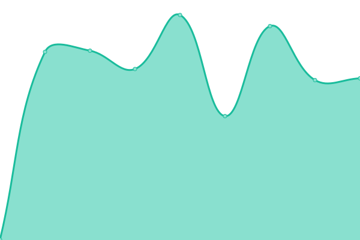

# [📈 Live Status](https://mskian.github.io/upptime): <!--live status--> **🟧 Partial outage**

This repository contains the open-source uptime monitor and status page for [Santhosh Veer](https://santhoshveer.com/), powered by [Upptime](https://github.com/upptime/upptime).

With [Upptime](https://upptime.js.org), you can get your own unlimited and free uptime monitor and status page, powered entirely by a GitHub repository. We use [Issues](https://github.com/mskian/upptime/issues) as incident reports, [Actions](https://github.com/mskian/upptime/actions) as uptime monitors, and [Pages](https://mskian.github.io/upptime) for the status page.

<!--start: status pages-->
<!-- This summary is generated by Upptime (https://github.com/upptime/upptime) -->
<!-- Do not edit this manually, your changes will be overwritten -->
<!-- prettier-ignore -->
| URL | Status | History | Response Time | Uptime |
| --- | ------ | ------- | ------------- | ------ |
|  [santhosh veer blog](https://santhoshveer.com) | 🟩 Up | [santhosh-veer-blog.yml](https://github.com/mskian/uptime/commits/HEAD/history/santhosh-veer-blog.yml) | 

 689ms
     
 | 

<a href="https://mskian.github.io/upptime/history/santhosh-veer-blog">100.00%</a>
    

|  [Itrendbuzz](https://itrendbuzz.com) | 🟩 Up | [itrendbuzz.yml](https://github.com/mskian/uptime/commits/HEAD/history/itrendbuzz.yml) | 

 642ms
     
 | 

<a href="https://mskian.github.io/upptime/history/itrendbuzz">100.00%</a>
    

|  [Allwebtuts](https://www.allwebtuts.com) | 🟥 Down | [allwebtuts.yml](https://github.com/mskian/uptime/commits/HEAD/history/allwebtuts.yml) | 

 93ms
     
 | 

<a href="https://mskian.github.io/upptime/history/allwebtuts">0.00%</a>
    

|  [kavithai site](https://kavithai.site) | 🟩 Up | [kavithai-site.yml](https://github.com/mskian/uptime/commits/HEAD/history/kavithai-site.yml) | 

 462ms
     
 | 

<a href="https://mskian.github.io/upptime/history/kavithai-site">100.00%</a>
    

<!--end: status pages-->

[**Visit our status website →**](https://mskian.github.io/upptime)

## 📄 License

- Powered by: [Upptime](https://github.com/upptime/upptime)
- Code: [MIT](./LICENSE) © [Anand Chowdhary](https://anandchowdhary.com), supported by [Pabio](https://pabio.com)
- Data in the `./history` directory: [Open Database License](https://opendatacommons.org/licenses/odbl/1-0/)
