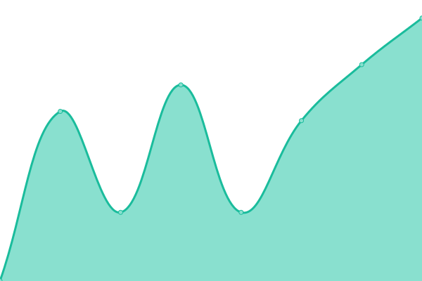
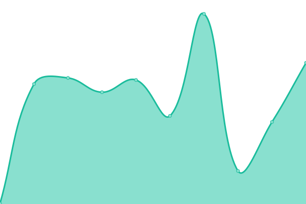

# [📈 Live Status](https://santhoshkumar.github.io/upptime): <!--live status--> **🟧 Partial outage**

This repository contains the open-source uptime monitor and status page for [Santhosh Veer](https://santhoshveer.com/), powered by [Upptime](https://github.com/upptime/upptime).

With [Upptime](https://upptime.js.org), you can get your own unlimited and free uptime monitor and status page, powered entirely by a GitHub repository. We use [Issues](https://github.com/santhoshkumar/upptime/issues) as incident reports, [Actions](https://github.com/santhoshkumar/upptime/actions) as uptime monitors, and [Pages](https://santhoshkumar.github.io/upptime) for the status page.

<!--start: status pages-->
<!-- This summary is generated by Upptime (https://github.com/upptime/upptime) -->
<!-- Do not edit this manually, your changes will be overwritten -->
<!-- prettier-ignore -->
| URL | Status | History | Response Time | Uptime |
| --- | ------ | ------- | ------------- | ------ |
|  [santhosh veer blog](https://santhoshveer.com) | 🟩 Up | [santhosh-veer-blog.yml](https://github.com/santhoshkumar/upptime/commits/HEAD/history/santhosh-veer-blog.yml) | 

 788ms
     
 | 

<a href="https://santhoshkumar.github.io/upptime/history/santhosh-veer-blog">100.00%</a>
    

|  [Itrendbuzz](https://itrendbuzz.com) | 🟩 Up | [itrendbuzz.yml](https://github.com/santhoshkumar/upptime/commits/HEAD/history/itrendbuzz.yml) | 

 716ms
     
 | 

<a href="https://santhoshkumar.github.io/upptime/history/itrendbuzz">99.47%</a>
    

|  [kavithai site](https://kavithai.site) | 🟩 Up | [kavithai-site.yml](https://github.com/santhoshkumar/upptime/commits/HEAD/history/kavithai-site.yml) | 

 545ms
     
 | 

<a href="https://santhoshkumar.github.io/upptime/history/kavithai-site">100.00%</a>
    

|  [Cricket Score](https://cricketblog.pages.dev/) | 🟩 Up | [cricket-score.yml](https://github.com/santhoshkumar/upptime/commits/HEAD/history/cricket-score.yml) | 

 140ms
     
 | 

<a href="https://santhoshkumar.github.io/upptime/history/cricket-score">100.00%</a>
    

|  [Quotes Status and Wishes](https://quotes.tamilwords.net/) | 🟩 Up | [quotes-status-and-wishes.yml](https://github.com/santhoshkumar/upptime/commits/HEAD/history/quotes-status-and-wishes.yml) | 

 459ms
     
 | 

<a href="https://santhoshkumar.github.io/upptime/history/quotes-status-and-wishes">100.00%</a>
    

|  [Alexa Score](https://score.santhoshveer.com/) | 🟩 Up | [alexa-score.yml](https://github.com/santhoshkumar/upptime/commits/HEAD/history/alexa-score.yml) | 

 573ms
     
 | 

<a href="https://santhoshkumar.github.io/upptime/history/alexa-score">100.00%</a>
    

|  TM Blog | 🟩 Up | [tm-blog.yml](https://github.com/santhoshkumar/upptime/commits/HEAD/history/tm-blog.yml) | 

 1132ms
     
 | 

<a href="https://santhoshkumar.github.io/upptime/history/tm-blog">100.00%</a>
    

|  VPN Server | 🟩 Up | [vpn-server.yml](https://github.com/santhoshkumar/upptime/commits/HEAD/history/vpn-server.yml) | 

 121ms
     
 | 

<a href="https://santhoshkumar.github.io/upptime/history/vpn-server">100.00%</a>
    

|  AD Server | 🟥 Down | [ad-server.yml](https://github.com/santhoshkumar/upptime/commits/HEAD/history/ad-server.yml) | 

 0ms
     
 | 

<a href="https://santhoshkumar.github.io/upptime/history/ad-server">100.00%</a>
    

|  Space | 🟩 Up | [space.yml](https://github.com/santhoshkumar/upptime/commits/HEAD/history/space.yml) | 

 293ms
     
 | 

<a href="https://santhoshkumar.github.io/upptime/history/space">94.80%</a>
    

|  API Driver | 🟩 Up | [api-driver.yml](https://github.com/santhoshkumar/upptime/commits/HEAD/history/api-driver.yml) | 

 446ms
     
 | 

<a href="https://santhoshkumar.github.io/upptime/history/api-driver">100.00%</a>
    

<!--end: status pages-->

[**Visit our status website →**](https://santhoshkumar.github.io/upptime)

## 📄 License

- Powered by: [Upptime](https://github.com/upptime/upptime)
- Code: [MIT](./LICENSE)
- Data in the `./history` directory: [Open Database License](https://opendatacommons.org/licenses/odbl/1-0/)
